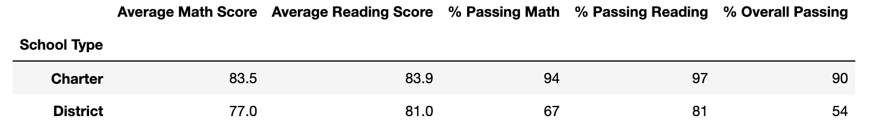
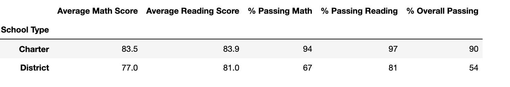
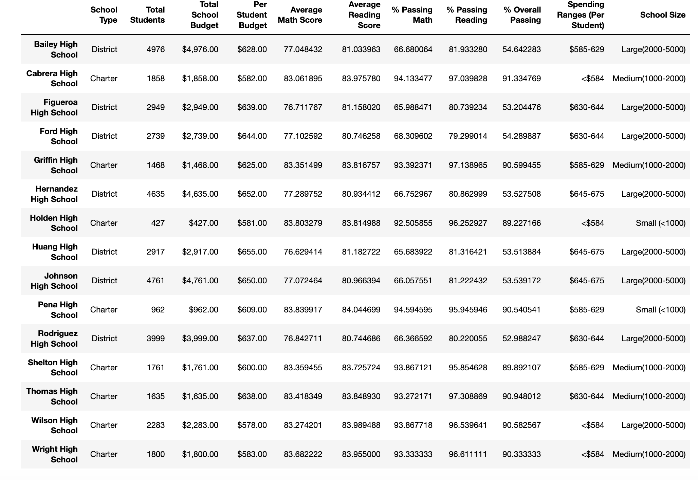
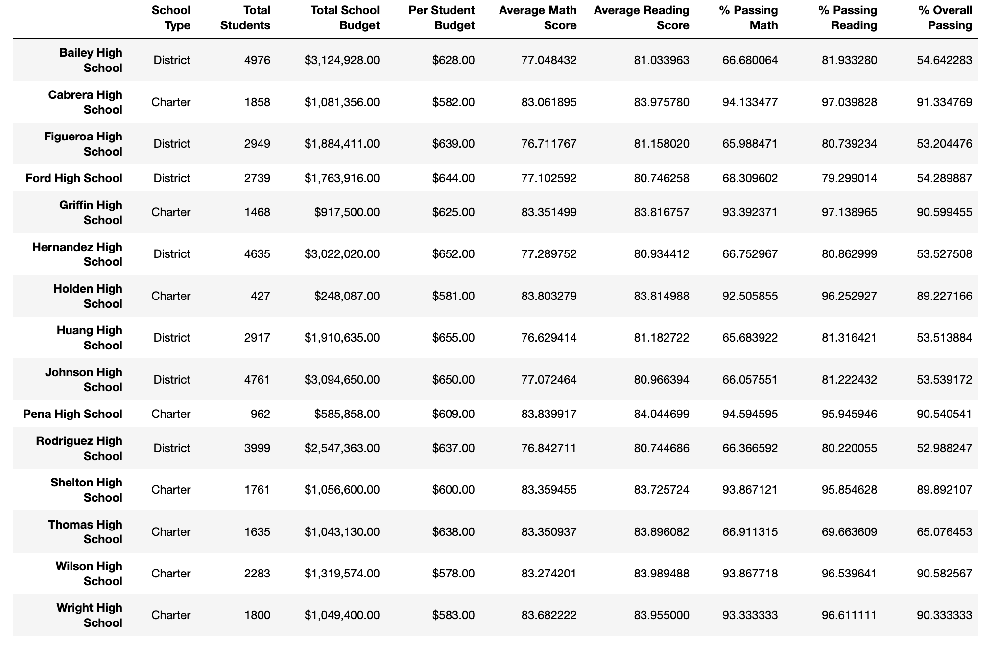

# School District Analysis
## Overview
The purpose of this analysis was to show the school board all the schools statistics, including the school type, size, average math and reading scores, passing math and reading percentages, and overall percentage passing. Another purpose of this analysis was to show the budgets and per student budget and how we can allocate it better per student. 
## Results
### District Summary
The district summary did not change, as you can see on the images taken. The reason is because the Thomas High School ninth graders were suspected of academic dishonesty and were taken out.
###### Before School District

###### After School District

### School Summary
The school summary budgets were the biggest change. The total budget increased, thus individual school's budgets were increased. We were able to categorize the school's size to allocate more money to the bigger sized schools, to increase the budget per student. Replacing the ninth graders scores at Thomas High School dramatically decreases THS' scores. Because they had to replace the ninth graders score, it made the ranking of Thomas High School go down in rank. In terms of grades, Thomas High School is not the bottom ranked of the math and reading scores based on grades. Because the grades have lowered, the spending based on grades have gone down for Thomas High. For school size, I think they are still average, even without the ninth graders. 
###### Before School Summary

###### After School Summary

## Summary
The biggest changes after adding the NaN's to the ninth graders at Thomas High are the school's size went decreased (decreasing the budget), the budget per student decreased due to the total students going down, the averages for both math and reading for Thomas High, and the overall passing percentage decreased.
